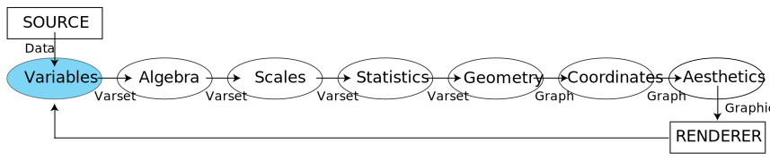
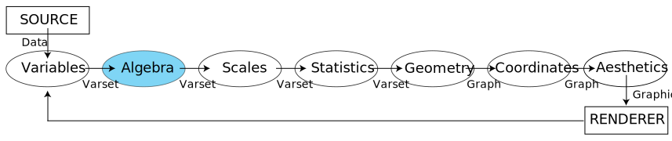
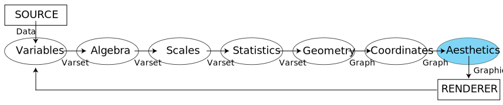
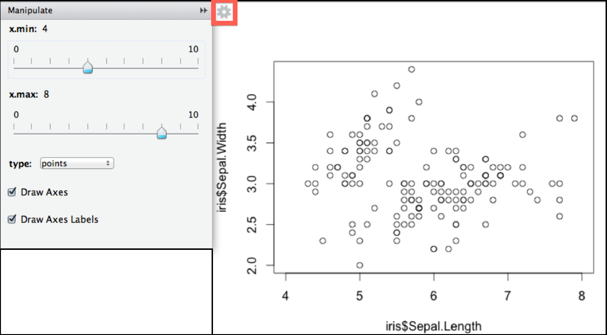

## Seminar Overview

1. Understanding the Grammar of Graphics
2. Terminology for Interactivity
3. Simple Interactions
4. Interactive Graphics for Pedagogical Purposes
5. Interactive Graphics for Applied Research
6. Leading Platforms and Packages
7. Future Research

--- .segue .quote .dark

<q> The grammar of graphics takes us beyond a <qe>limited set</qe> of charts (words) to 
an almost unlimited world of <qe>graphical forms</qe> (statements).</q>

<aut>-Wilkinson, 2005, p. 1</aut>

---

## The Grammar of Graphics

### Wilkinson (1999, 2005)

* Chart typologies versus general graphics in graphical software
  * Software will necessarily offer __fewer charts__ than people want
  * Software will less deep __structure__, and so be inefficient
* Wilkinson's monograph aimed to replace chart typographies with an overarching language
* However, the *Grammar of Graphics* was primarily a theoretical treatise
* No direct implementation

---

### Grammar of Graphics Fundamentals

The grammar is broken up into three components:

1. **Specification:** Translating what we expect to happen into a formal language
2. **Assembly:** The coordination of the specified attributes.
3. **Display:** The actual rendering of the graphic onto a display system

Assembly and Display are typically products of the hardware and software we use, and Wilkinson's
primary emphasis is on Specification.

---

### The heart of the Grammar of Graphics

1. **Algebra:** Operations that combine variables and specify dimensions of graphs
2. **Scales:** Representing variables on measured dimensions
3. **Statistics:** Functions that allow graphs to change appearance and representation schemes
4. **Geometry:** Creation of geometric graphs from variables
5. **Coordinates:** Coordinate systems (from polar to complex map projections)
6. **Aesthetics:** Sensory attributes used to represent graphics
7. **Facets and Guides:** Allows for coordination between graphs and tables, and annotations

---

## Conceptual Workflow for Graphic Creation

<br / >

<div style='text-align: center;'>
    
</div>

<br / >  

**Important notes:**

* Difference between "data", "varset", "graph", and "graphic"
* One way process (with iteration)
* Order is important!

---

<div style='text-align: center;'>
    
</div>

<smbr></smbr>

The first step is to extract data into variables.
* The variable mapping function must return a single value in the range for every index.
* Data can be broadly defined: 
  * a relational database
  * indexing a stream of words
  * a picture
* Can be the product of bootstrapping, or even metadata.
* Can apply variable transformations (mathematical, statistical, multivariate)

---

<div style='text-align: center;'>
    
</div>

<smbr></smbr>

We then can apply various algebraic techniques to the varset, which will define the structure of our plot.
* Three primary operators: 
  * Cross: a two-dimensional scatterplot (e.g., city copulation for 2000 and 2010)
  * Nest: facets data by group variable (e.g., data for USA and data for World)
  * Blend: scatterplot with multiple overlays (e.g., data for 2000 and 2010)
* Output of this stage is a `varset`

---

<div style='text-align: center;'>
    
</div>

<smbr></smbr>

These are functions that are used to map varsets to dimensions (size, shape, and location).
* For example, with categorical data, we could do this based upon natural (alphabetic) order, relative frequency, or even length of string
* General scale types:
  * Categorical
  * Linear
  * Time
  * "One-Bend" (e.g., logarthmic, power)
  * "Two-Bend" (e.g., arcsine, logit/probit, probability)

---

<div style='text-align: center;'>
    
</div>

<smbr></smbr>

Statistical operations can be employed to reduce the number of rows in the varset.
* These are methods that alter the position of geometric graps.
* Five primary methods:
  * Bin (rect/tri/hex/quantile/boundary/voronoi/dot/stem)
  * Summary (count/proportion/sum/mean/median/mode/sd/se/range/leaf)
  * Region (spread/confi)
  * Smooth (linear/quadratic/cubic/log/spline/density)
  * Link (join/sequence/mst/hull/tsp/complete/neighbor)

---

<div style='text-align: center;'>
    
</div>

<smbr></smbr>

These functions create graph objects that can be represented by magnitudes in a space.
* These are not actually visible (as they don't have aesthetic attributes)!
  * Functions: point/line/area/interval/path/schema
  * Partitions: polygon/contour
  * Networks: edges
* Geometric objects can impose collision modifers to avoid overlap (e.g., jitter)

---

<div style='text-align: center;'>
    
</div>

<smbr></smbr>

Our next step is to choose and apply a coordinates system.
* These are sets that locate points in space.
* Planar transformations:
  * Isometry (reflect, rotate, translate) and Similarity (dilate)
  * Affine (shear, stretch), Projective (project), and Conformal
* Projections on a plane:
  * Perspective projections; Triangular coordinates; Map projections
* 3D and high dimensional coordinate systems
* For example, a pie chart is simply a stacked bar chart plotted in polar coordinates, with bar height mapped to the angle of the slice.

---

<div style='text-align: center;'>
    
</div>

<smbr></smbr>

Form     | Surface  | Motion   | Sound    | Text
:--------: | :--------: | :--------: | :--------: | :--------:
Position | Color    | Direction | Tone    | Label
Size  | &nbsp;&nbsp; * Hue | Speed | Volume | 
Shape | &nbsp;&nbsp; * Brightness | Acceleration | Rhythm | 
&nbsp;&nbsp; * Polygon | &nbsp;&nbsp; * Saturation | | Voice |
&nbsp;&nbsp; * Glyph | Texure | | |
&nbsp;&nbsp; * Image | &nbsp;&nbsp; * Pattern | | |
Rotation | &nbsp;&nbsp; * Granularity | | |
Resolution | &nbsp;&nbsp; * Orientation | | |
 | Blur | | | 
 | Transparency|||

<span style="display: block; text-align: right; font-size: 70%;">(Wilksinson, 2005, p. 274)</span>

---

### Specification: The Building Blocks of Graphical Displays 

Any statistical graphic can be expressed in terms of six statements:

1. **DATA:** These expressions involve the creation of variables from datasets
2. **TRANS:** Apply variable transformations (for instance, rank)
3. **SCALE:** Apple scale transformations (for instance, log)
4. **ELEMENT:** Define graphs (e.g., points) and their aesthetic attributes (e.g., color)
5. **COORD:** Define the coordinate system (e.g., polar)
6. **GUIDE:** Define guides to aid interpretation (e.g. axes, legends, et cetera)

---

### A conceptual example: A grouped scatterplot

<blockcode style="border:2px solid black;">
DATA: sepallength = "SepalLength" <br />
DATA: sepalwidth = "SepalWidth" <br />
TRANS: sepallength = sepallength <br />
TRANS: sepalwidth = sepalwidth <br />
SCALE: linear(dim(1)) <br />
SCALE: linear(dim(2)) <br />
ELEMENT: point(position(sepallength*sepalwidth), color(species)) <br />
COORD: rect(dim(1,2)) <br />
GUIDE: axis(dim(1), label("Sepal Length")) <br />
GUIDE: axis(dim(2), label("Sepal Width")) <br />
</blockcode>

However, as most of these actions would be the default of a well-organized graphical system, only the Element statements are truly necessary.

---

## Take home message:

<smbr></smbr>

<q2 style="border:2px solid black;"> 
The Grammar of Graphics paradigm... means that, rather than having lots of different functions, each of which produces a different sort of plot,there is a small set of functions, each of which produces a different sort of plot *component*, and those components can be *combined* in many different ways to produce a huge variety of plots.
<br />
<span style="display: block; text-align: right;">-Murrell, 2011</span>
</q2>

---

## The `gg` in `ggplot2`:

General Principals for ggplot2:

1. Define the data you want to plot and create a plot template with `ggplot()`
2. Specify the aesthetics of the shapes that will be used to represet the data with `aes()`
3. Specify the graphical shapes (`geoms`) that will be used to view the data
  * Add them with the appropriate function; e.g. `geom_point()` or `geom_line()`
4. Call the object to view it

---

## Implementation

Components of a graph:
* `Data`: What we want to see!
* `Geoms`: Geometric objects that are drawn to represent the data (determine the type of plot )
* `Stats`: Statistical transformations of the data (e.g., binning or averaging)
* `Scales`: Controls mapping between data and aesthetics (variable or constant) 
* `Coord`: The coordinate system (provides axes and gridlines)
* `Facets`: Allows us to break up the data into subsets
* `Themes`: Relatively new `ggplot2` feature that allows for visual adjustments of a plot object 

---

## From Wilkinson to Wickham:

Building the grouped scatterplot:

```{r groupscat1, eval=FALSE, echo=TRUE, tidy=FALSE}
library(ggplot2)
dat <- iris
plot <- ggplot(data = dat, 
               aes(x = Sepal.Length, y = Sepal.Width, colour = Species)) +
               geom_point() +
               theme_bw()
```

---

## The grouped scatterplot:

```{r groupscat2, eval=TRUE, echo=FALSE, fig.width=13, fig.height=7.5, fig.align='center', out.extra='style="border:2px solid black;"'}
library(ggplot2)
dat <- iris
plot <- ggplot(data = dat, aes(x = Sepal.Length, y = Sepal.Width, 
          colour = Species)) + geom_point() + theme_bw()
plot
```

---

## Wilkinson or Wickham?

Is this a perfect implementaion of the Grammar of Graphics?

> * In the theoretical grammar, we have data, a mapping of data to graph, and the graph itself
> * In `ggplot2`, we have to deal with:
   * Constructing the data into an interpretable format (a `data.frame` object)
   * The R syntax for `ggplot2`
   * The underlying `ggplot2` object
   * The generated graph, which is only constructed when `print()` or `ggsave()` is called
   * The "pipeline" is less restrictive (e.g., we can apply aesthetics before coordinates)

---

## Wilkinson or Wickham?

Is this problematic?

> * No! 
> * The `ggplot2` maintains the core beliefs of the system
    * The object created has a hierarchical structure, even if it is not immediately apparent
    * Look at `str(plot)`
> * The `+` operator allows us to make changes to the general plot object
> * Additional geom calls add layers that allow us to build up a graphic
> * While not as flexible as Wilkinson's theoretical framework, substantially more practical.

--- .segue .quote .dark

<q style='text-align: center;'>Dynamic, interactive visualizations... <br /> <qe>empower people</qe> <br /> to explore the data for themselves.</q>

<aut><br />-Murray, 2013, p. 2</aut>

--- .segue .quote .dark

<q>Overview first, zoom and filter, then details-on-demand.</q>

<aut style='text-align: right;'><br / >-Shneiderman, 1996, p. 337 <br / > (the "Visual Information Seeking Mantra")</aut>

---

## Why interaction?

* It is now easier than ever to provide online supplements for research
* Justifiability: The reader can "see it for themselves"
* Discoverability: Allows access to views and projections of the data that were previously hard to conceptualize

---

## Terminology for Interactive Graphics

* __Selection__ – the ability of users to dynamically subset the data
* __Probing__ – the generation of "ToolTips" for particular data points
* __Panning and Zooming__ – allows for the traversal of complex datasets 
* __Drill Down__ - allows for the navigation of a categorical hierarchy
* __Slice__ – live faceting of the data
* __Modification__ - provide sandbox for users to explore

---

## Simple Interactions

The most basic interactions would allow the user to dynamically alter the parameters of a plot. This feature is already built into RStudio with the `manipulate` package. 

For example, the following code allows users to dynamically alter:
* The x-axis limits
* Chart type
* Axes and axes labelling

```{r echo=TRUE, eval=FALSE, tidy=FALSE}
manipulate(plot(iris$Sepal.Length, iris$Sepal.Width, 
                xlim = c(x.min, x.max), type = type, axes = axes, ann = label), 
           x.min = slider(0,10, initial = 4), 
           x.max = slider(0,10, initial = 8),
           type = picker("points" = "p", "line" = "l", "none" = "n", 
                         initial = "points"),
           axes = checkbox(TRUE, "Draw Axes"),
           label = checkbox(TRUE, "Draw Axes Labels"))
```

---

### RStudio's `manipulate` package

<div style='text-align: center;'>
    
</div>

---

### RStudio's `manipulate` package

While easy to use, unfortauntely, `manipulate` has some draw-backs:

* It is not designed for presentation, and is only available from within the GUI
* Interactive graphics cannot be distributed outside of an R code snippet
* Limited number of parameters are manipulatable
* Limited number of choices in terms of how to manipulate parameters

---

### `clickme` Scatterplot

A more interesting example comes courtesy of Nacho Cabellero's `clickme` package.  

The goals of this package are to:

1. Create easily sharable dynamic plots
2. Allow for different types of plots via templates (presently only points are supported)
3. Incorporate optional parameters to change how the visualization behaves

For example, here are the results of conducting multidimensional scaling on the `iris` dataset:

```{r clickme1, echo=FALSE, eval=FALSE}
library(clickme)
loc <- cmdscale(dist(iris[,1:4]))
ex1 <- clickme(Points,
        x = loc[,1], y = loc[,2],
        color_groups = dat[,5],
        title = "Iris Multidimensional Scaling",
        xlab = "Dimension 1",
        ylab = "Dimension 2",
        dir = getwd())
ex1
```

---

<iframe src="http://www.dfconsulting.org/QMforum/temp-Points.html" width="90%" height="90%"
  style="border:3px solid black;">Loading</iframe>

---

## Interactive Plots for Pedagogy

Interactivity can also be harnessed for pedagogical purposes.  For instance, while teaching introductory statistics, we might want to visually demonstrate how skewness and kurtosis affect a distribution.

We can do this live via the `shiny` package, which allows us to create a web application framework for R with "reactive bindings".

---

<div style="width: 100%; height: 85%; overflow: hidden; border:3px solid black;">
<iframe src="http://glimmer.rstudio.com/msigal/skewkurt/">Loading</iframe>
</div>

<br />

<span style="display: block; text-align: center; font-size: 90%;">(This is an approximation based upon the sinh-arcsinh transformation; Jones & Pewsey, 2009)</span>

---

## Interactive Chart with Shiny Controls

```{r opts.label = 'shiny'}
slidifyUI(
  sidebarPanel(
    selectInput('sex', 'Choose Sex', c('Male', 'Female')),
    selectInput('type', 'Choose Type',
      c('multiBarChart', 'multiBarHorizontalChart')
    )
  ),
  mainPanel(
    tags$div(id = 'nvd3plot', class='shiny-html-output nvd3 rChart')
  )
)
```

--- &interactive

## Interactive R Console for Time Series

```{r opts.label = 'interactive', results = 'asis'}
require(rCharts)
a <- Highcharts$new()
a$chart(type = "spline")
a$series(data = c(1, 3, 2, 4, 5, 4, 6, 2, 3, 5, NA), dashStyle = "longdash")
a$series(data = c(NA, 4, 1, 3, 4, 2, 9, 1, 2, 3, 4), dashStyle = "shortdot")
a$legend(symbolWidth = 80)
a$print('chart3')
```

--- &interactive

## Interactive Console with googleVis

```{r opts.label = 'interactive', results = 'asis'}
suppressPackageStartupMessages(library(googleVis))
M1 <- gvisMotionChart(Fruits, idvar = 'Fruit', timevar = 'Year')
print(M1, tag = 'chart')
```

---

### Interactive Tableplot

---

## Other Visualization Librairies

D3

* Popular for constructing interactive networks and maps
* Combination of HTML, JavaScript, CSS, and D3

---

### Other JavaScript libraries:

* Processing

---

### Leveraging JavaScript libraries within R

* rCharts
* example

---

## Platform Comparison

__R Packages__
* `animint` has a similar feature set to `clickme`, but targeted specifically for ggplot2 graphics.
  * `require(devtools)` and then `install_github("animint","tdhock")`
* Pros
* Cons

---

## Future Research

* Build model specific but data generic applications available for distribution
* Encourage researchers to provide online resources for readers to interact with
* In particular, plan to code specific applications to aid in outlier detection
and influence diagnostics for structucal equation models.

<!---
&vcenter


## Other Examples 
&vcenter

-->

---

## Contact

* Matthew J. Sigal, MA
    * [matthewsigal@gmail.com](mailto:matthewsigal@gmail.com)
    * [msigal@yorku.ca](mailto:msigal@yorku.ca)
    * Department of Psychology
    * 262 Behavioural Science Building
    * York University, 4700 Keele St.
    * Toronto, ON, Canada M3J 1P3
    * (416) 736-2100 x66163
* My websites: 
    * [http://www.matthewsigal.com](http://www.matthewsigal.com)
    * [http://www.dfconsulting.org](http://www.dfconsulting.org)

---

## Packages used in this presentation:

* Hadley Wickham's `ggplot2`
* Nacho Caballero's `clickme`
  * `require(devtools); install_github("clickme", "nachocab")`
* RStudio's `manipulate` and `shiny`
* Ramnath Vaidyanathan's `rCharts`
  * `require(devtools); install_github('rCharts', 'ramnathv')`

* Slides made with Ramnath Vaidyanathan's `slidify` package
  * `require(devtools); install_github('slidify', 'ramnathv'); 
  * `require(devtools); install_github('slidifyLibraries', 'ramnathv')`

---

## Selected References

* Shneiderman, B. (1996). The eyes have it. _Proc. IEEE Visual Languages_, pp. 336-343.
* Jones, M. C. and Pewsey A. (2009). Sinh-arcsinh distributions. __Biometrika__, 96, pp. 761–780.

