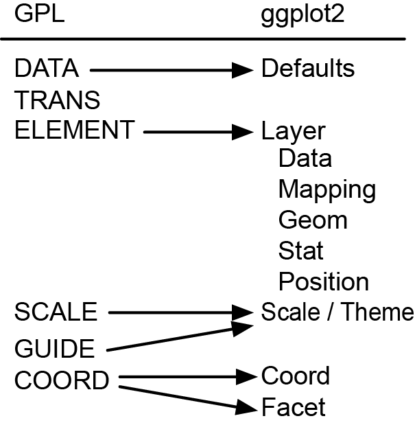

## Seminar Overview

1. Understanding the Grammar of Graphics
2. Terminology for Interactive Graphics
3. Interactive Graphic Examples
4. Leading Platforms and Packages
5. Future Research

--- .segue .quote .dark

<q> The grammar of graphics takes us beyond a <qe>limited set</qe> of charts (words) to 
an almost unlimited world of <qe>graphical forms</qe> (statements).</q>

<aut>-Wilkinson, 2005, p. 1</aut>

---

## The Grammar of Graphics

### Wilkinson (1999, 2005)

* Chart typologies versus general graphics in graphical software
  * Software will necessarily offer __fewer charts__ than people want
  * Software will lack deep __structure__, and so be inefficient
* Wilkinson's monograph aimed to replace chart typographies with an overarching language
* However, the *Grammar of Graphics* was primarily a theoretical treatise
* It was later implemented by Wilkinson in both the proprietary <monos>Graphics Production Language</monos> of <monos>SPSS</monos> and <monos>nViZn</monos>, the backbone of the <monos>SPSS Visualization Designer</monos> application

---

### Grammar of Graphics Fundamentals

The grammar is broken up into three components:

1. **Specification:** Translating what we expect to happen into a formal language  
2. **Assembly:** The coordination of the specified attributes.  
3. **Display:** The actual rendering of the graphic onto a display system  

<br / >
**Assembly** and **Display** are typically products of the software and hardware we use, so Wilkinson's
primary emphasis is on **Specification**.

---

### The heart of the Grammar of Graphics

1. **Algebra:** Operations that combine variables and specify graph dimensionality
2. **Scales:** Represent variables on measured dimensions
3. **Statistics:** Functions that allow graphs to change appearance and representation schemes
4. **Geometry:** Creation of geometric objects from variables
5. **Coordinates:** Coordinate systems (from polar to complex map projections)
6. **Aesthetics:** Sensory attributes used to represent graphics
7. **Facets and Guides:** Allows for coordination between graphs and tables, and annotations

---

## Conceptual Workflow for Graphic Creation

<br / >

<div style='text-align: center;'>
    
</div>

<br / >  

**Important notes:**

* Difference between "data", "varset", "graph", and "graphic"
* One way process (with iteration)
* Order is important!

---

<div style='text-align: center;'>
    
</div>

<smbr></smbr>

The first step is to extract data into variables.
* The variable mapping function returns a single value in the range for every index.
* Data can be broadly defined: 
  * a relational database
  * indexing a stream of words
  * a picture
  * can be the product of bootstrapping, or even metadata.
* Can apply variable transformations (mathematical, statistical, multivariate)
* Output of this stage is a `varset`

---

<div style='text-align: center;'>
    
</div>

<smbr></smbr>

We then can apply various algebraic techniques to the varset, which will define the structure (or frame) of our plot. 

__Three primary operators__: 
  * Cross (\*): crosses all values of X with all values of Y, and a result exists for every case.
    * e.g., a two-dimensional scatterplot depicting city population for 2000 and 2010
  * Nest (/): nests all values of X in all of values of Z, results only exist for particular combinations.
    * e.g., facet by group variable; city/country produces separate plots for USA and Canada
  * Blend (+): Combines all values of X with all values of Y on the same dimension 
    * e.g., plot the combined population for cities in 2000 and 2010

---

<div style='text-align: center;'>
    
</div>

<smbr></smbr>

These are functions that are used to map varsets to dimensions (size, shape, and location).
* For example, with categorical data, we could do this based upon natural (alphabetic) order, relative frequency, or even length of string
* General scale types:
  * Categorical
  * Linear
  * Time
  * "One-Bend" (e.g., logarthmic, power)
  * "Two-Bend" (e.g., arcsine, logit/probit, probability)

---

<div style='text-align: center;'>
    
</div>

<smbr></smbr>

Statistical operations can be employed to reduce the number of rows in the varset.
* These are methods that can alter the positions of the geometric plot symbols.
* Five primary methods:
  * __Bin__ (rect/tri/hex/quantile/boundary/voronoi/dot/stem)
  * __Summary__ (count/proportion/sum/mean/median/mode/sd/se/range/leaf)
  * __Region__ (spread/confi)
  * __Smooth__ (linear/quadratic/cubic/log/spline/density)
  * __Link__ (join/sequence/mst/hull/tsp/complete/neighbor)

---

<div style='text-align: center;'>
    
</div>

<smbr></smbr>

These functions create graph objects that can be represented by magnitudes in a space.
* These are not actually visible (as they don't yet have aesthetic attributes)!
  * Functions: point/line/area/interval/path/schema
  * Partitions: polygon/contour
  * Networks: edges
* Geometric objects can impose collision modifers to avoid overlap (e.g., jitter)

---

<div style='text-align: center;'>
    
</div>

<smbr></smbr>

Our next step is to choose and apply a coordinates system.
* These are sets that locate points in space, and are amenable to transformation.
* Planar transformations:
  * Isometry (reflect, rotate, translate) and Similarity (dilate)
  * Affine (shear, stretch), Projective (project), and Conformal
* Projections on a plane:
  * Perspective projections; Triangular coordinates; Map projections
* 3D and high dimensional coordinate systems
* For example, a pie chart is simply a stacked bar chart plotted in polar coordinates, with bar height mapped to the angle of the slice.

---

<div style='text-align: center;'>
    
</div>

<smbr></smbr>

Form     | Surface  | Motion   | Sound    | Text
:--------: | :--------: | :--------: | :--------: | :--------:
Position | Color    | Direction | Tone    | Label
Size  | &nbsp;&nbsp; * Hue | Speed | Volume | 
Shape | &nbsp;&nbsp; * Brightness | Acceleration | Rhythm | 
&nbsp;&nbsp; * Polygon | &nbsp;&nbsp; * Saturation | | Voice |
&nbsp;&nbsp; * Glyph | Texure | | |
&nbsp;&nbsp; * Image | &nbsp;&nbsp; * Pattern | | |
Rotation | &nbsp;&nbsp; * Granularity | | |
Resolution | &nbsp;&nbsp; * Orientation | | |
 | Blur | | | 
 | Transparency|||

<span style="display: block; text-align: right; font-size: 70%;">(Wilksinson, 2005, p. 274)</span>

---

### Specification: The Building Blocks of Graphical Displays 

In GPL, any statistical graphic can be expressed in terms of six statements:

1. **DATA:** These expressions involve the creation of variables from datasets
2. **TRANS:** Apply variable transformations (for instance, rank)
3. **ELEMENT:** Define graphs (e.g., points) and their aesthetic attributes (e.g., color)
4. **SCALE:** Apple scale transformations (for instance, log)
5. **GUIDE:** Define guides to aid interpretation (e.g. axes, legends, et cetera)
6. **COORD:** Define the coordinate system (e.g., Cartesian, polar)

---

### A conceptual example: A grouped scatterplot

<blockcode style="border:2px solid black;">
DATA: x = "SepalLength" <br />
DATA: y = "SepalWidth" <br />
DATA: z = "species" <br />
TRANS: x = x <br />
TRANS: y = y <br />
ELEMENT: point(position(x*y), color(z)) <br />
COORD: rect(dim(1,2)) <br />
SCALE: linear(dim(1)) <br />
SCALE: linear(dim(2)) <br />
GUIDE: axis(dim(1), label("Sepal Length")) <br />
GUIDE: axis(dim(2), label("Sepal Width")) <br />
</blockcode>

However, as most of these actions would be the default of a well-organized graphical system, only the ELEMENT statement is truly necessary.

---

## Take home message:

<smbr></smbr>

<q2 style="border:2px solid black;"> 
The Grammar of Graphics paradigm... means that, rather than having lots of different functions, each of which produces a different sort of plot, there is a small set of functions, each of which produces a different sort of plot *component*, and those components can be *combined* in many different ways to produce a huge variety of plots.
<br />
<span style="display: block; text-align: right;">-Murrell, 2011</span>
</q2>

---

## The `gg` in `ggplot2`:

General Principals for `ggplot2`:

1. Define the data you want to plot and create a plot template with `ggplot()`
2. Specify the aesthetics of the shapes that will be used to represet the data with `aes()`
3. Specify the graphical shapes (`geoms`) that will be used to view the data
  * Add them with the appropriate function; e.g. `geom_point()` or `geom_line()`
4. Call the object to render and view it

---

## Implementation

Components of a `ggplot2` object:
* One or more `Layers` consisting of:
  * `Data`: What we want to see!
  * `Mapping`: Defines the aesthetics of the graphic
  * `Stat`: Statistical transformations of the data (e.g., binning or averaging)
  * `Geom`: Geometric objects that are drawn to represent the data (simple or complex)
  * `Position`: Position adjustments for each geom (e.g., jitter, dodge, stack)
* `Scale`: Controls mapping between data and aesthetics (variable or constant; colour/position) 
* `Themes`: Relatively new `ggplot2` feature that allows for visual adjustments of a plot object 
* `Coord`: The coordinate system (provides axes and gridlines)
* `Facet`: Allows us to break up the data into subsets

---

## Mapping between `GPL` and `ggplot2`

<br />
<div style='text-align: center;'>
    
</div>

<br />
<span style="display: block; text-align: right; font-size: 90%;">(Based upon Wickham, 2010)</span>

---


## From Wilkinson to Wickham:

Building the grouped scatterplot:


```r
library(ggplot2)
dat <- iris
p1 <- ggplot(data = dat, 
             aes(x = Sepal.Length, y = Sepal.Width, colour = Species)) +
             geom_point() +
             theme_bw()
p1
```


---

## The grouped scatterplot:


---

## Wilkinson or Wickham?

Is this a perfect implementaion of the Grammar of Graphics?

> * In the theoretical grammar, we have data, a mapping of data to graph, and the graph itself
> * In `ggplot2`, we have to deal with:
   * Constructing the data into an interpretable format (a `data.frame` object)
   * The R syntax for `ggplot2`
   * The underlying `ggplot2` object
   * The generated graph, which is only constructed when `print()` or `ggsave()` is called

---

## Wilkinson or Wickham?

Is this problematic?

> * No! 
> * The `ggplot2` maintains the core beliefs of the system
    * The object created has a hierarchical structure, even if it is not immediately apparent
    * Look at `str(plot)`
> * The `+` operator allows us to make changes to the general plot object
> * Additional geom calls add layers that allow us to build up a graphic
> * The "pipeline" is less restrictive (e.g., we can apply aesthetics before coordinates)
> * While not as flexible as Wilkinson's theoretical framework, substantially more practical.

--- .segue .quote .dark

<q style='text-align: center;'>Dynamic, interactive visualizations... <br /> <qe>empower people</qe> <br /> to explore the data for themselves.</q>

<aut><br />-Murray, 2013, p. 2</aut>

--- .segue .quote .dark

<q>Overview first, zoom and filter, then details-on-demand.</q>

<aut style='text-align: right;'><br / >-Shneiderman, 1996, p. 337 <br / > (the "Visual Information Seeking Mantra")</aut>

---

## Why interaction?

* It is now easier than ever to provide online supplements for research
* Justifiability: The reader can "see it for themselves"
* Discoverability: Allows access to views and projections of the data that were previously hard to conceptualize
* Narrative: We can curate a virtual experience to convey a meaningful story, especially to an audience that we might not have been able to reach otherwise

---

## Terminology for Interactive Graphics

* __Selection__ – the ability of users to dynamically subset the data
* __Slice__ – live faceting of the data
* __Probing__ – the generation of "ToolTips" for particular data points
* __Panning and Zooming__ – allows for the traversal of complex datasets 
* __Drill Down__ – allows for the navigation of a categorical hierarchy
* __Modification__ – provide sandbox for users to explore

---

## Simple Interactions

The most basic interactions allow the user to dynamically alter the parameters of a plot. This feature is already built into RStudio with the `manipulate` package. 

For example, the following code allows users to dynamically alter:
* The x-axis limits
* Chart type
* Axes and axes labelling


```r
manipulate(plot(iris$Sepal.Length, iris$Sepal.Width, 
                xlim = c(x.min, x.max), type = type, axes = axes, ann = label), 
           x.min = slider(0, 10, initial = 4), 
           x.max = slider(0, 10, initial = 8),
           type = picker("points" = "p", "line" = "l", "none" = "n", 
                         initial = "points"),
           axes = checkbox(TRUE, "Draw Axes"),
           label = checkbox(TRUE, "Draw Axes Labels"))
```


---

### RStudio's `manipulate` package

<div style='text-align: center;'>
    
</div>

---

### RStudio's `manipulate` package

While easy to use, unfortauntely, `manipulate` has some draw-backs:

* It is not designed for presentation, and is only available from within the GUI
* Interactive graphics cannot be distributed outside of an R code snippet
* Limited number of parameters are manipulatable
* Limited number of choices in terms of how to manipulate parameters

---

### `clickme` Scatterplot

A more interesting example comes courtesy of Nacho Cabellero's `clickme` package.  

The goals of this package are to:

1. Create easily sharable dynamic plots
2. Allow for different types of plots via templates (presently only points are supported)
3. Incorporate optional parameters to change how the visualization behaves

For example, here are the results of conducting multidimensional scaling on the `iris` dataset:


---

<iframe src="http://www.dfconsulting.org/QMforum/temp-Points.html" width="90%" height="90%"
  style="border:3px solid black;">Loading</iframe>

---

## Interactive Plots for Pedagogy

Interactivity can also be harnessed for pedagogical purposes.  For instance, while teaching introductory statistics, we might want to visually demonstrate how skewness and kurtosis affect a distribution.

We can do this live via the `shiny` package, which allows us to create a web application framework for R with "reactive bindings".

---

<div style="width: 100%; height: 85%; overflow: hidden; border:3px solid black;">
<iframe src="http://glimmer.rstudio.com/msigal/skewkurt/">Loading</iframe>
</div>

<br />

<span style="display: block; text-align: center; font-size: 90%;">(This is an approximation based upon the sinh-arcsinh transformation; Jones & Pewsey, 2009)</span>

--- &interactive

## Interactive Console with googleVis

<div>
<textarea class='interactive' id='interactive{{slide.num}}' data-cell='{{slide.num}}' data-results='asis' style='display:none'>suppressPackageStartupMessages(library(googleVis))

bub <- gvisBubbleChart(Fruits, 
  idvar = "Fruit", 
  xvar = "Sales", 
  yvar = "Expenses", 
  colorvar = "Year", 
  sizevar = "Profit", options=list(hAxis='{minValue:75, maxValue:125}')
)

print(bub, tag = 'chart')</textarea>

</div>

<span style="display: block; text-align: center; font-size: 30%; color:#ffffff;">M1 <- gvisMotionChart(Fruits, idvar = 'Fruit', timevar = 'Year'); plot(M1, tag = 'chart')</span>

---

## Other Visualization Librairies

* I am a big fan of `R` (if it should be done, there probably is a package)
* However, there are a wide variety of other languages to choose from when thinking about implementing interactive graphics.
* Many are based upon JavaScript and are designed to be stand-alone web applications.

---

## `D3.js` (Data-Driven Documents)

* Based upon `Protovis` from the Stanford Visualization Group
* Popular for constructing interactive networks and maps
* Combination of HTML, JavaScript, CSS, and D3
* Output is rendered in SVG (lossless)
* Extremely versatile, but applications are typically directed

---

## `D3.js` (Data-Driven Documents)

<div style="width: 100%; height: 90%; overflow: hidden; border:3px solid black;">
<iframe src="http://bl.ocks.org/mbostock/raw/4062045/">Loading</iframe>
</div>

---

## `sigma.js`: A library for interactive networks

<div style="width: 100%; height: 85%;">
<iframe src="http://www.dfconsulting.org/QMforum/sigmajs/sigma.html">Loading</iframe>
</div>

---

## `Polymaps`: US Unemployment 2009 Example

<div style="width: 100%; height: 85%; overflow: hidden; border:3px solid black;">
<iframe src="http://www.dfconsulting.org/QMforum/polymaps/examples/unemployment/unemployment.html">Loading</iframe>
</div>

---

### Leveraging JS libraries via `rCharts`: `Highcharts.js`

<div style="width: 100%; height: 85%; overflow: hidden; border:3px solid black;">
<iframe src="http://rstudio-pubs-static.s3.amazonaws.com/9773_b39e1a7b7b3b44159f99ba358c0925b7.html">Loading</iframe>
</div>

---

### Leveraging JS libraries via `rCharts`: `NVD3.js`

<div style="width: 100%; height: 85%; overflow: hidden; border:3px solid black;">
<iframe src="http://glimmer.rstudio.com/msigal/shinyrChart/">Loading</iframe>
</div>

---

## Other Approaches: 

[__Mondrian__](http://stats.math.uni-augsburg.de/mondrian/):
* Local application written in Java, offers linked plots, some interactions, and queries.

[__Eikosogram__](http://sas.uwaterloo.ca/~rwoldfor/software/eikosograms/):
* Small Java applet for visualizing probabilistic concepts. 

[__Tableau__](http://www.tableausoftware.com/): 
* Interactive applets for business analytics.
* Latest version features R integration!

[__Processing__](http://www.processing.org/) and [__Processing.js__](http://www.processingjs.org/):
* Language designed for interactive graphics.

[__Many Eyes__](http://www-958.ibm.com/software/analytics/manyeyes/):
* Public hosting of data and graphic templates, sponsored by IBM.

---

## Other Approaches:

__R Packages__
* `Acinonyx`, aka "iPlots eXtreme" - designed for large data (development limbo?)
  * `install.packages("Acinonyx","http://rforge.net")`
* `animint` has a similar feature set to `clickme`, but targeted specifically for `ggplot2` graphics.
  * `require(devtools)` and then `install_github("animint","tdhock")`
* `animation` (self-explanatory; no interactivity)
* `cranvas` reimplements `GGobi` (parallel coordinate plots; limited interactivity)
  * [Installation instructions](https://github.com/ggobi/cranvas/wiki)
* `d3network` allows for the creation of D3-based force direction graphs in R
  * `require(devtools); install_github("d3Network", "christophergandrud")`
* `gridSVG` creates interactive `ggplot2` + `D3` objects
  * `install.packages("gridSVG", repos="http://R-Forge.R-project.org")`

---

## ...And finally back to Wickham.

* One of Hadley Wickham's latest projects is reimplementing the grammar of graphics with interactive applications on the web in mind. This project, called `ggvis` is still in development, but already has a plethora of examples.
* Refines the grammar of graphics (and one day might replace `ggplot2`)
* In `ggplot2`, geom is kind of abstract (e.g., `geom_histogram()` combines `geom_bar()` and `stat_bin()`). In `ggvis`, pure geoms are called "marks", and combined geoms and stats are referred to as "branches".
* No `qplot()` (or overloaded +)!
* Rendered plots can be drawn on the canvas or as SVG
* Interactivity! e.g. `mark_symbol(props(size = input_slider(100, 1000))`

```
# Installation:
library(devtools)
install_github(c("assertthat", "testthat"))
install_github(c("httpuv", "shiny", "ggvis"), "rstudio")
```

---

## The Grand Tour...

<iframe src="http://glimmer.rstudio.com/msigal/tourdemo/" width="900" height="450">Loading</iframe>

---

## Future Research

* Build model specific but data generic applications available for distribution
* Encourage researchers to provide online resources for readers to interact with
* In particular, plan to code specific applications to aid in outlier detection
and influence diagnostics for structucal equation models.

--- 

## Conclusion

* Many JavaScript libraries are available to create interactive graphics, however they do not follow the tenets of the grammar of graphics, and are often a challenge to adapt to new datasets.
  * `rCharts` leverages this somewhat by allow us to utilize JS libraries from within `R`.
* `ggvis` and `ggplot2` are both attempts at implementing Wilkinson's Grammar of Graphics in `R`.
* The later package features a core restructuring that actually brings it closer to the ideals of the underlying grammar by removing and elaborating upon some of the ambiguties of `ggplot2`.
* It also demonstrates how interaction can be embedded within that grammar.
  * This can basically be thought of as a loop, where parameters are able to be changed on the fly, which produces an instantaneous rerendering of the plot.
  * Just as entire plots can be thought of as embedded geoms (see `ggsubplot`), we can think of an interactive plot as a Grammar of Graphics pipeline that is continuously rendering.
* There are many potential applications for these new technologies ready to be adapted for analysis and implementation.

---

## Contact

__Matthew J. Sigal, MA__  
Department of Psychology  
262 Behavioural Science Building  
York University, 4700 Keele St.  
Toronto, ON, Canada M3J 1P3  
(416) 736-2100 x66163  

[matthewsigal@gmail.com](mailto:matthewsigal@gmail.com) / [msigal@yorku.ca](mailto:msigal@yorku.ca)  
<br />
[http://www.matthewsigal.com](http://www.matthewsigal.com)  
[http://www.dfconsulting.org](http://www.dfconsulting.org)  

---

## Packages used and referenced in this presentation:

* Hadley Wickham's `ggplot2` and `ggvis`
* Nacho Caballero's `clickme`
  * `require(devtools); install_github("clickme", "nachocab")`
* RStudio's `manipulate` and `shiny`
* Ramnath Vaidyanathan's `rCharts`
  * `require(devtools); install_github('rCharts', 'ramnathv')`

* Slides made with RStudio via Ramnath Vaidyanathan's `slidify`
  * `require(devtools); install_github('slidify', 'ramnathv');` 
  * `require(devtools); install_github('slidifyLibraries', 'ramnathv')`

---

## Selected References

* Cleveland, W. S. (1994). _The elements of graphing data_. Hobart Press.
* Few, S. (2009). _Now you see it_. Analytics Press.
* Fry, B. (2007). Visualizing data: Exploring... data with the Processing environment. O’Reilly.
* Jones, M. C. \& Pewsey A. (2009). Sinh-arcsinh distributions. _Biometrika_, _96_, 761–780.
* Murray, S. (2013). _Interactive data visualization for the web_. O’Reilly.
* Murrell, P. (2011). _R graphics_. Chapman and Hall/CRC, 2nd edition.
* Shneiderman, B. (1996). The eyes have it. _Proc. IEEE Visual Languages_, 336-343.
* Theus, M. \& Urbanek, S. (2009). _Interactive graphics for data analysis_. Taylor & Francis.
* Wickham, H. (2009). _ggplot2: Elegant graphics for data analysis_. Springer, 2nd edition.
* Wilkinson, L. (2005). _The grammar of graphics_. Springer, 2nd edition. 
* Yau, N. (2011). _Visualize this_. Wiley.  
<br />
<span style="display: block; text-align: center; font-size: 110%; font-weight: bold">Slides available at: [http://mattsigal.github.io/InteractiveGraphics/](http://mattsigal.github.io/InteractiveGraphics/)</span>
